今年もこの時期がやってきました 🎤

iOS関連技術をコアのテーマとした技術者のためのカンファレンスである「iOSDC Japan 2025」の採択結果が公開されました。この記事では各発表枠毎の投稿数・採択数（率）を可視化することで傾向などを探ります。


## iOSDC Japan 2025 概要
日程：2025年9月19日(Fri)〜21日(Sun)
会場：🆕 有明セントラルタワーホール&カンファレンス
配信：ニコニコ生放送
チケット料金：
　ノベルティ付き一般（オンラインのみ）：2,750円
　ノベルティ付き一般（オフライン + オンライン）：8,800円
　サポーター：16,500円
　U-23：2,750円
公式サイト： https://iosdc.jp/2025/

今年は例年の早稲田大学から場所を移し、有明セントラルタワーホール&カンファレンスにて実施されます。Kaigi on Rails 2024 でも利用された施設ですね。

## 登壇（発表）枠とプロポーザル集計
それぞれの登壇枠毎にプロポーザルの集計を行います。

:::message
開催前のため2025年の数値に関しては変動する可能性があります。
カンファレンス実施後に確定版へ更新します。
:::


### 20分トーク枠
変更点：特になし

2025年のサマリー
📄 投稿数：213本 / ⬆️増加（6本）
🎤 採択数：N/A

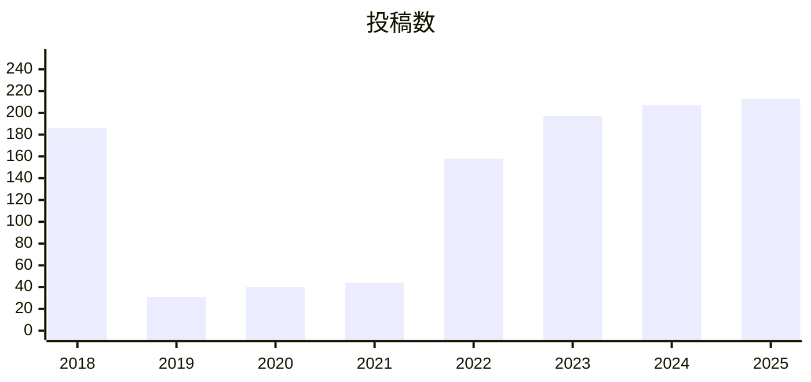

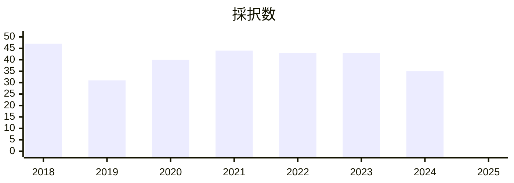


補足[^talk20m]


### 40分トーク枠
変更点：特になし

2025年のサマリー
📄 投稿数：43本 / ⬇️減少（9本）
🎤 採択数：N/A

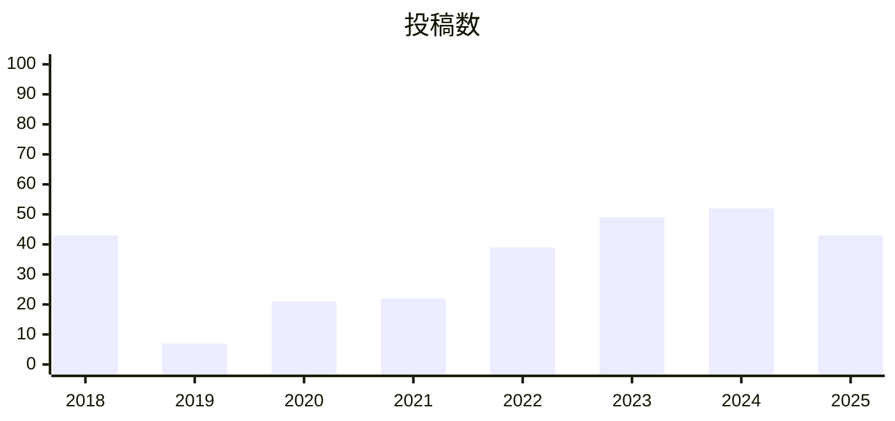

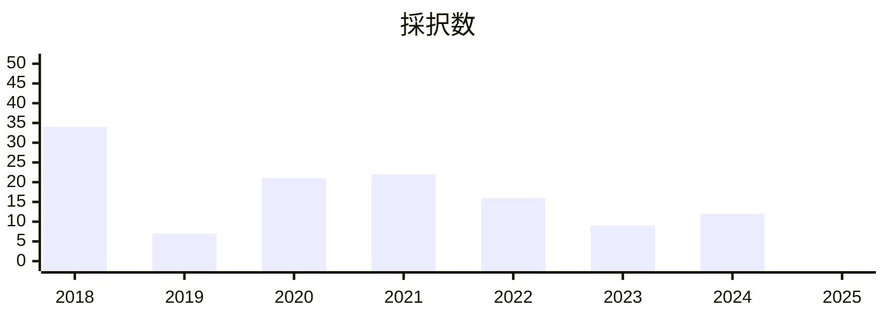


補足[^talk40m]


### LT枠
2025年のサマリー
📄 投稿数：82本 / ⬇️減少（6本）
🎤 採択数：N/A

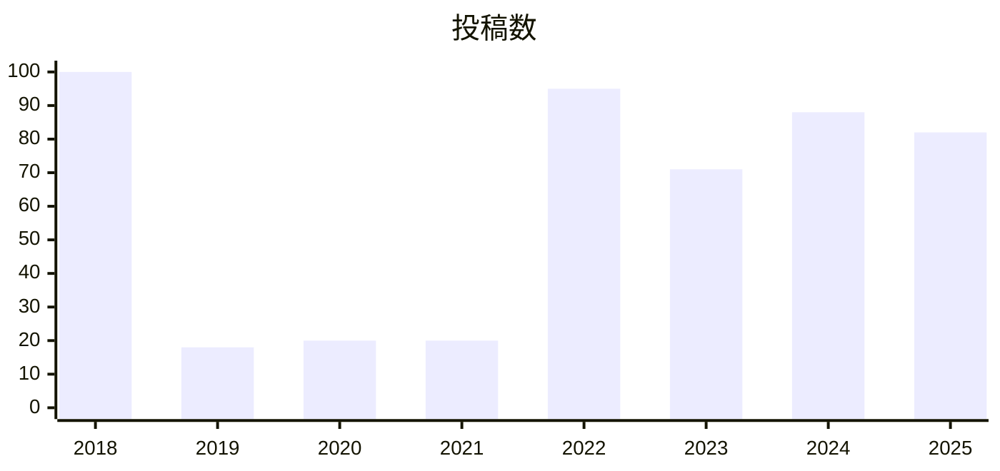

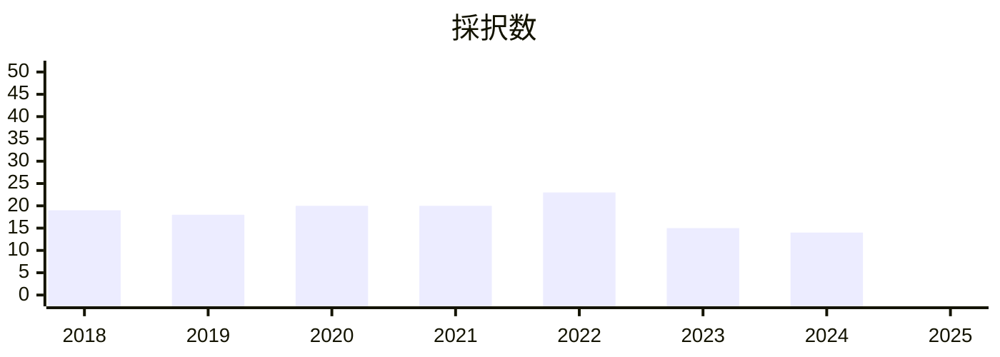

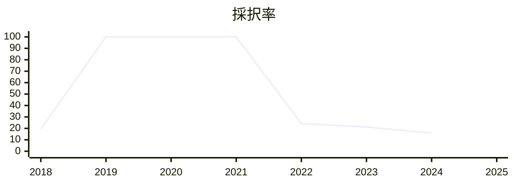


### ルーキーズLT枠
変更点：特になし

2025年のサマリー
📄 投稿数：104本 / ⬇️減少（23本）
🎤 採択数：N/A

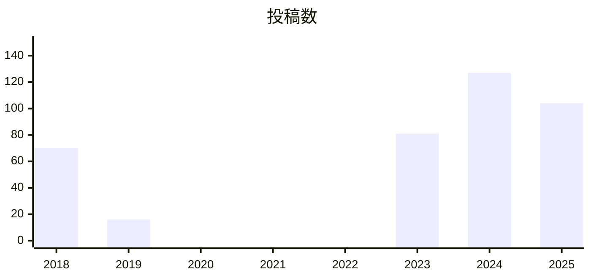

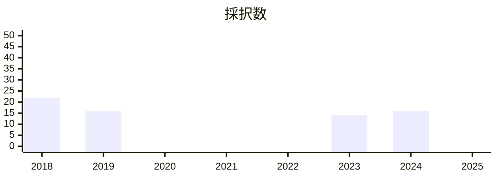

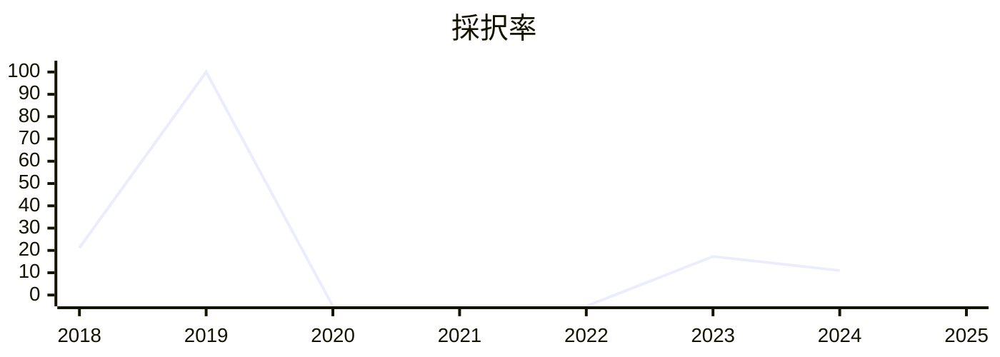

補足[^rookieLT]


### 2pパンフレット枠
変更点：特になし

2025年のサマリー
📄 投稿数：8本 / ⬆️増加（6本）
🎤 採択数：3本 / ⬆️増加（1本）

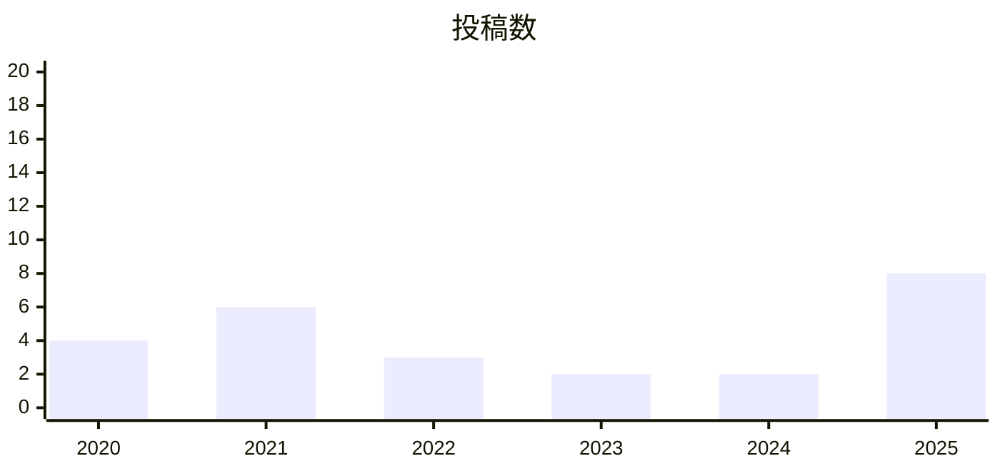

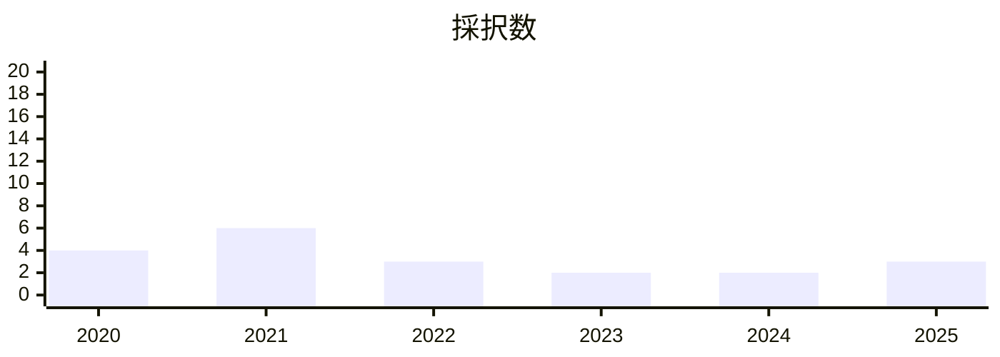

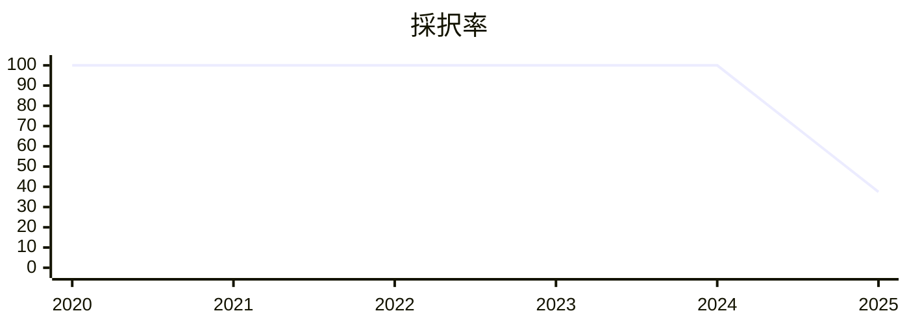

補足[^brochure2p]


### 4pパンフレット枠
変更点：特になし

2025年のサマリー
📄 投稿数：18本 / ⬆️増加（4本）
🎤 採択数：15本 / ⬆️増加（1本）

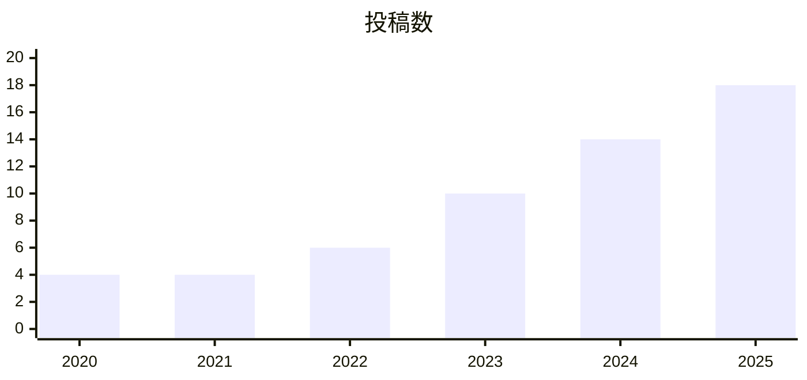

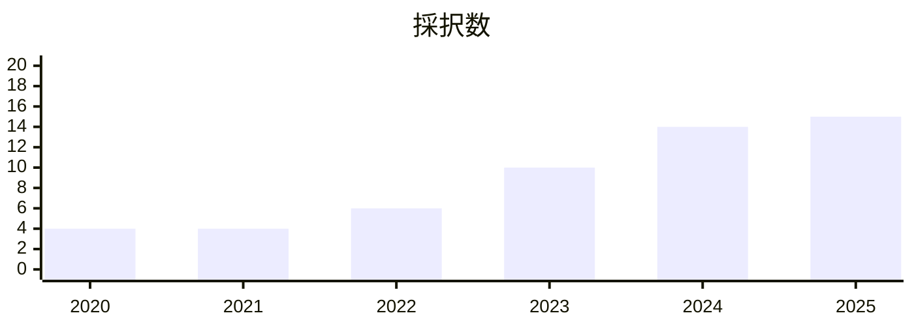

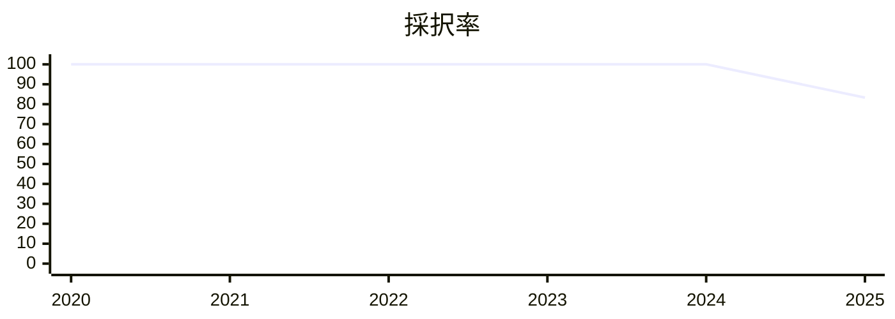

補足[^brochure4p]


### 8pパンフレット枠
変更点：特になし

2025年のサマリー
📄 投稿数：11本 / ⬆️増加（4本）
🎤 採択数：9本 / ⬆️増加（2本）

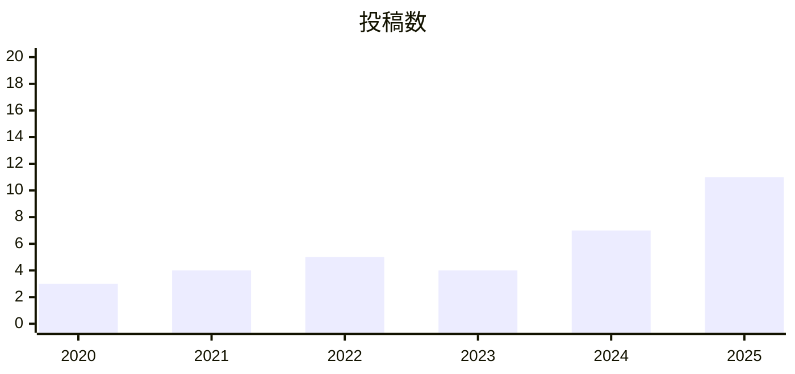

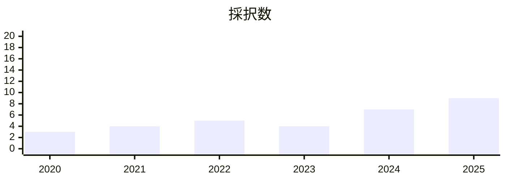

```mermaid
---
config:
    xyChart:
        height: 250
---
xychart-beta
    title "採択率"
    x-axis [2020, 2021, 2022, 2023, 2024, 2025]
    y-axis 0 --> 100
    line [100, 100, 100, 100, 100, 81.8]
```

補足[^brochure8p]


## まとめ
OOの枠は例年よりも採択数が増加しており、狙い目でしたね


---

[^talk20m]: 2018年はトーク（15分）枠、2019年はトーク（30分）枠の集計となります。
[^talk40m]: 2018年はトーク（30分）枠、2019年はトーク（60分）枠の集計となります。
[^rookieLT]: 2020・2021・2022年はルーキーズLT枠が存在しません。
[^brochure2p]: 2018・2019年は枠が存在しません。
[^brochure4p]: 2018・2019年は枠が存在しません。
[^brochure8p]: 2018・2019年は枠が存在しません。
