今年もこの時期がやってきました 🎤

iOS関連技術をコアのテーマとした技術者のためのカンファレンスである「iOSDC Japan 2025」の採択結果が公開されました。この記事では各発表枠毎の投稿数・採択数（率）を可視化することで傾向などを探ります。


## iOSDC Japan 2025 概要
日程：2025年9月19日(Fri)〜21日(Sun)
会場：🆕 有明セントラルタワーホール&カンファレンス
配信：ニコニコ生放送
チケット料金：
　ノベルティ付き一般（オンラインのみ）：2,750円
　ノベルティ付き一般（オフライン + オンライン）：8,800円
　サポーター：16,500円
　U-23：2,750円
公式サイト： https://iosdc.jp/2025/

今年は例年の早稲田大学から場所を移し、有明セントラルタワーホール&カンファレンスにて実施されます。Kaigi on Rails 2024 でも利用された施設ですね。

## 登壇（発表）枠とプロポーザル集計
それぞれの登壇枠毎にプロポーザルの集計を行います。

:::message alert
開催前のため2025年の数値に関しては変動する可能性があります。
カンファレンス実施後に確定版へ更新します。
:::

:::message
mermaid のベータ機能である xychart でグラフを作成しています。
設定上は年ごとの本数表示を行うようにしていますが、なぜか表示されていないです。
:::

### 20分トーク枠
枠の変更点：特になし

2025年のサマリー
📄 投稿数：213本 / ⬆️増加（6本）
🎤 採択数：34本 / ⬇️減少（1本）

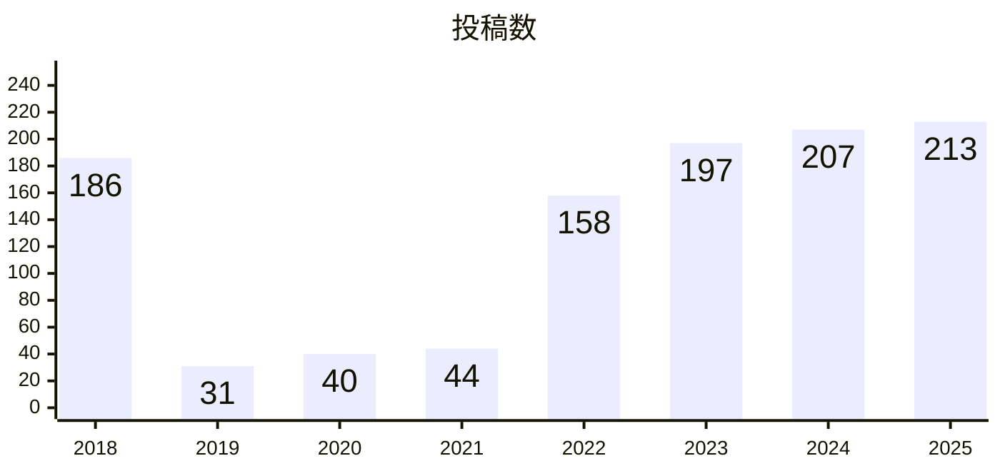

2025年の投稿本数：213本
直近3年の投稿数平均：205.7本

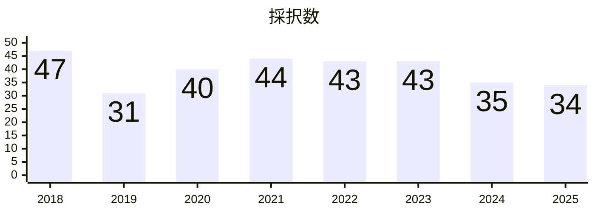

2025年の採択本数：34本
直近3年の採択数平均：37.3本

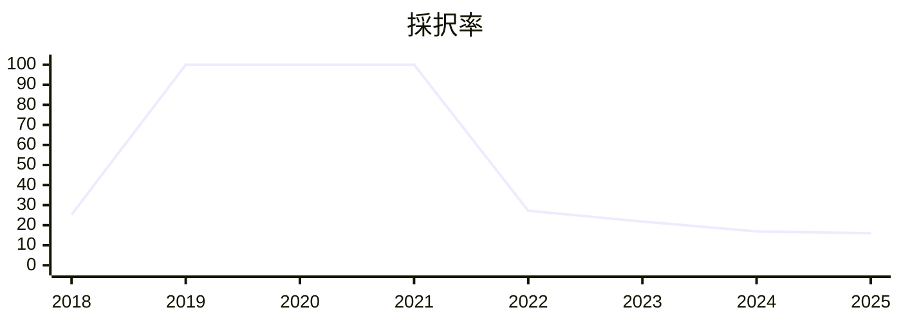

補足[^talk20m]


### 40分トーク枠
枠の変更点：特になし

2025年のサマリー
📄 投稿数：43本 / ⬇️減少（9本）
🎤 採択数：11本 / ⬇️減少（1本）

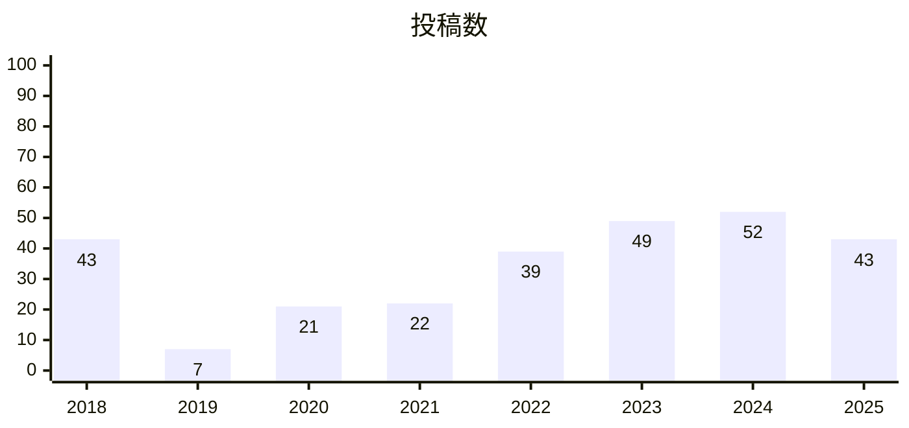

2025年の投稿本数：43本
直近3年の投稿数平均：48本

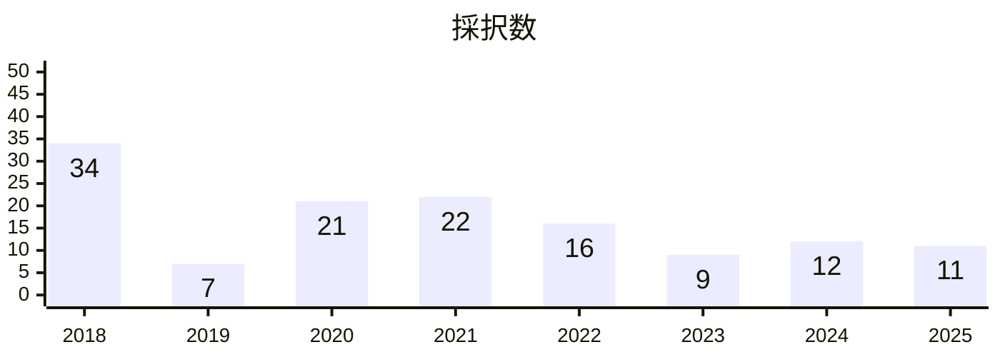

2025年の採択本数：11本
直近3年の採択数平均：10.7本

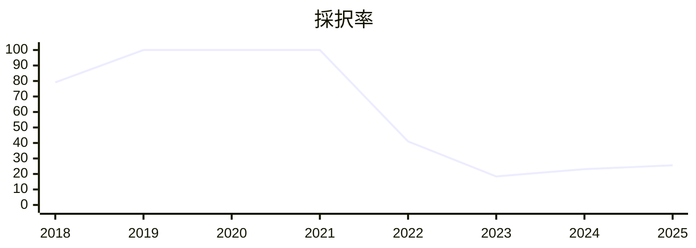

補足[^talk40m]


### LT枠
枠の変更点：特になし

2025年のサマリー
📄 投稿数：82本 / ⬇️減少（6本）
🎤 採択数：17本 / ⬆️増加（3本）

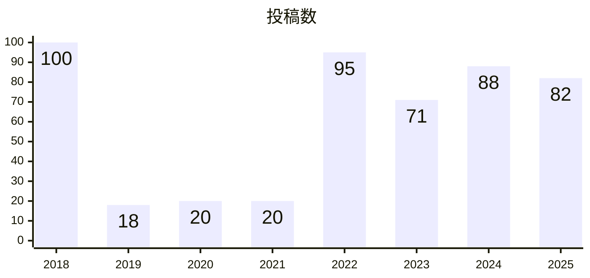

2025年の投稿本数：82本
直近3年の投稿数平均：80.3本

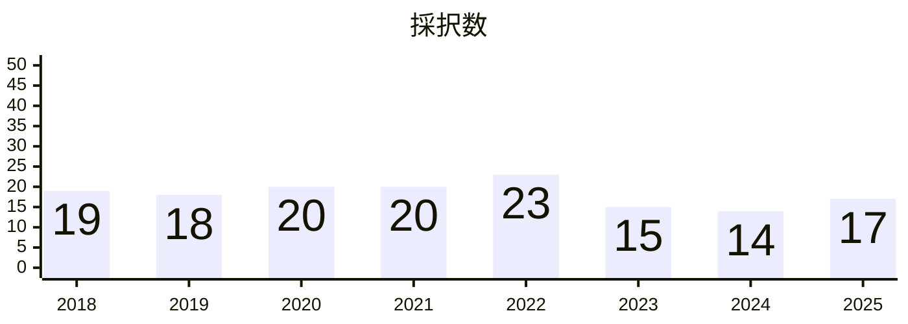

2025年の採択本数：17本
直近3年の採択数平均：15.3本

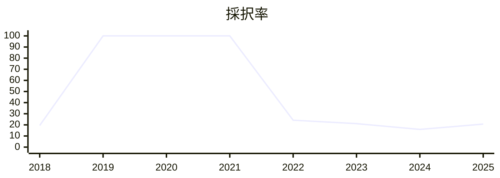


### ルーキーズLT枠
枠の変更点：特になし

2025年のサマリー
📄 投稿数：104本 / ⬇️減少（23本）
🎤 採択数：14本 / ⬇️減少（2本）

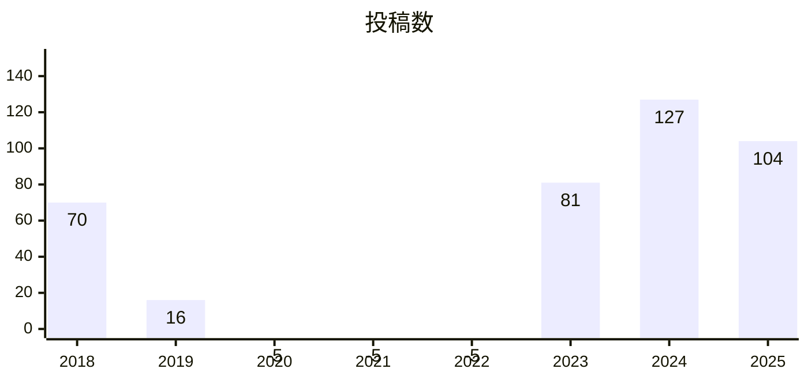

2025年の投稿本数：104本
直近3年の投稿数平均：104本

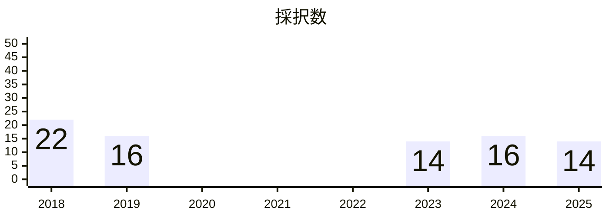

2025年の採択本数：14本
直近3年の採択数平均：14.7本

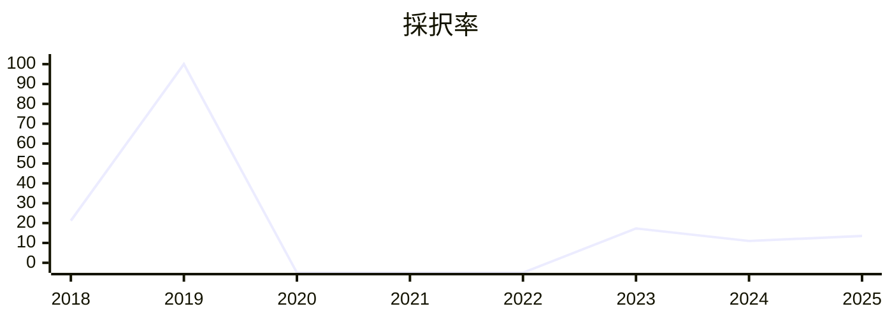

補足[^rookieLT]


### 2pパンフレット枠
枠の変更点：特になし

2025年のサマリー
📄 投稿数：8本 / ⬆️増加（6本）
🎤 採択数：3本 / ⬆️増加（1本）

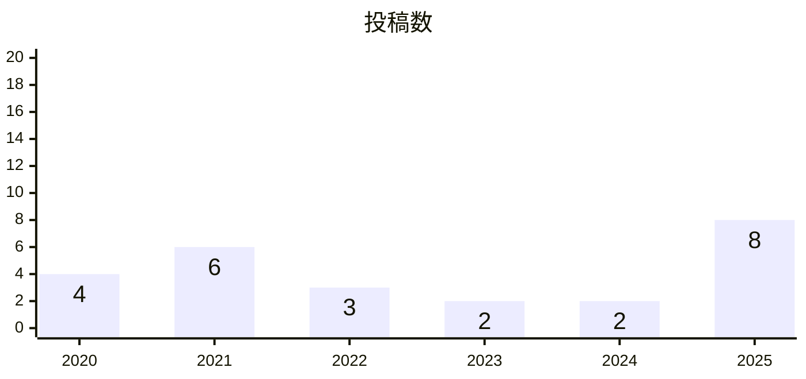

直近3年の投稿数平均：4本

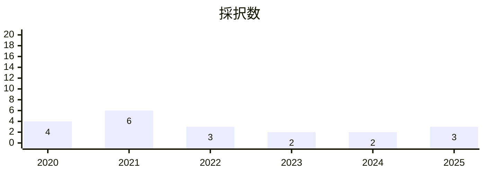

直近3年の投稿数平均：2.3本


補足[^brochure2p]


### 4pパンフレット枠
枠の変更点：特になし

2025年のサマリー
📄 投稿数：18本 / ⬆️増加（4本）
🎤 採択数：15本 / ⬆️増加（1本）

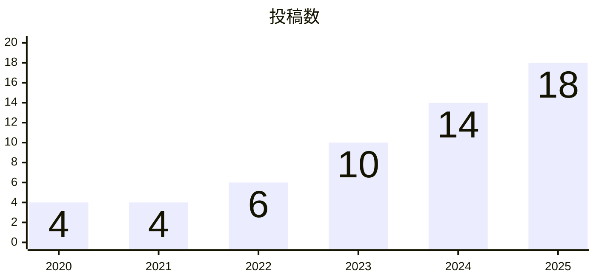

直近3年の投稿数平均：14本

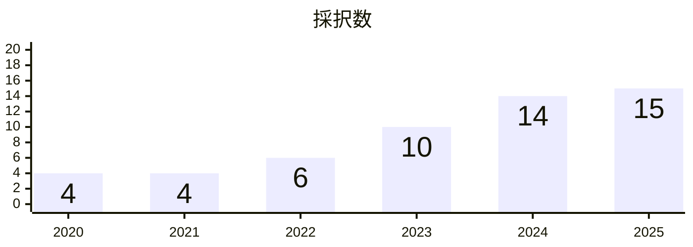

直近3年の採択数平均：13本


補足[^brochure4p]


### 8pパンフレット枠
枠の変更点：特になし

2025年のサマリー
📄 投稿数：11本 / ⬆️増加（4本）
🎤 採択数：9本 / ⬆️増加（2本）

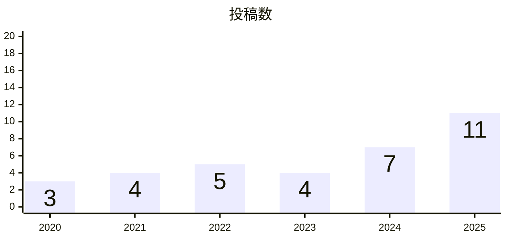

直近3年の投稿数平均：7.3本

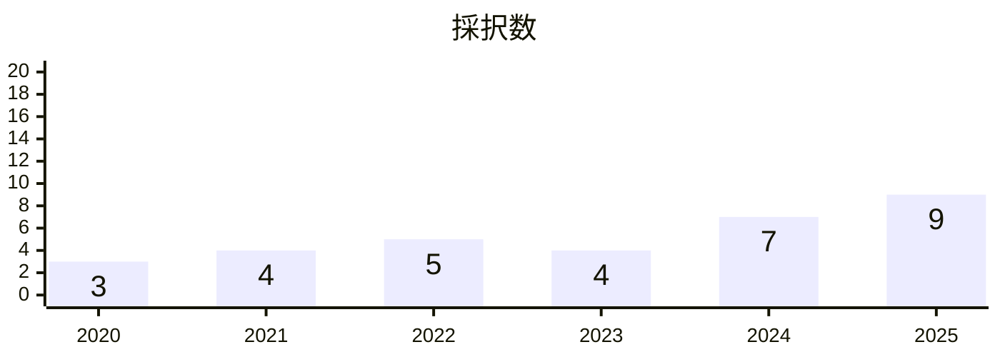

直近3年の採択数平均：6.7本

```mermaid
---
config:
    xyChart:
        height: 250
---
xychart-beta
    title "採択率"
    x-axis [2020, 2021, 2022, 2023, 2024, 2025]
    y-axis 0 --> 100
    line [100, 100, 100, 100, 100, 81.8]
```

補足[^brochure8p]


## まとめ
今年は例年採択率100％だったパンフレット枠が、投稿本数増加により採用されないものが見られました。

トークの本数に関しても20分枠以外はプロポーザル本数がやや減少しています。

---

[^talk20m]: 2018年はトーク（15分）枠、2019年はトーク（30分）枠の集計となります。
[^talk40m]: 2018年はトーク（30分）枠、2019年はトーク（60分）枠の集計となります。
[^rookieLT]: 2020・2021・2022年はルーキーズLT枠が存在しません。
[^brochure2p]: 2018・2019年は枠が存在しません。
[^brochure4p]: 2018・2019年は枠が存在しません。
[^brochure8p]: 2018・2019年は枠が存在しません。
