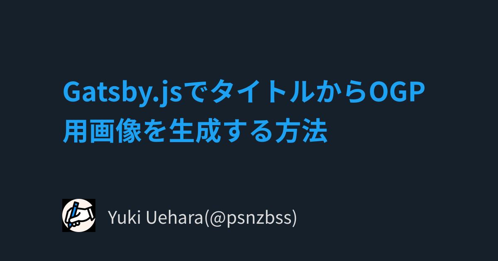
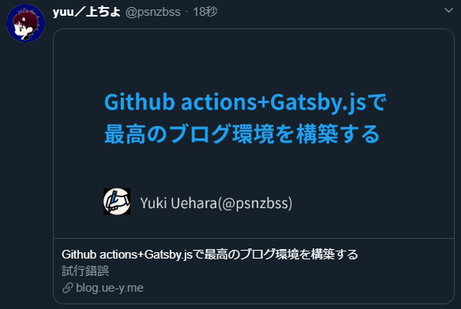

生成するとこんな感じの画像が出来上がります



Gatsby.jsに色々な機能を実装していますが、今回はOGP用の画像を自動生成します。OGP？なにそれという方に簡単に説明すると、OGPは[Open Graph Protocol]の略でTwitterやLINE、Slackに記事をシェアした際にリンクが画像とともに大きく表示される、あれです。

今回はSNS等でシェアした際に表示される画像を記事のタイトルから生成します。



※完成イメージ

## 利用するパッケージのインストール
OGP用画像を生成するパッケージって色々あって、かなり機能豊富なものから、必要最低限のものまですでに用意されています。しかしー　これらほぼ全て『日本語対応』していません。つらい！

ということで、このブログを作った初期から探し求めていたパッケージですが、先日ついに見つけてしまったので、機能実装することができました。（フルスクラッチで作る技量はありません...）

matsuken([@_kentaro_m](https://twitter.com/_kentaro_m)) さんが作成した[catchy-image](https://github.com/kentaro-m/catchy-image)というパッケージを利用します。

これはnode.jsのモジュールであって、Gatsby.js用のプラグインではありません。私が利用している環境上npmでパッケージをインストールする必要があるのでnpmパッケージに登録しました。

[Gatsby-remark-sns-images](https://github.com/psbss/gatsby-remark-sns-images)

```bash:title=bash
npm install --save gatsby-remark-sns-images
```

インストールができたら、```gatsby-config.js```に配置します。

```js:title=gatsby-config.js
resolve: `gatsby-transformer-remark`,
      options: {
        plugins: [
          {
          resolve: `gatsby-remark-sns-images`,
            options: {
              output: {
                directory: '',
                fileName: 'thumbnail.png'
              },
              image: {
                width: 1200,
                height: 630,
                backgroundColor: '#15202B',
              },
              style: {
                title: {
                  fontFamily: 'Noto Sans CJK JP',
                  fontColor: '#1DA1F2',
                  fontWeight: 'bold',
                  fontSize: 64,
                  paddingTop: 100,
                  paddingBottom: 200,
                  paddingLeft: 150,
                  paddingRight: 150,
                },
                author: {
                  fontFamily: 'Noto Sans CJK JP',
                  fontColor: '#DDDDDD',
                  fontWeight: '400',
                  fontSize: 42,
                }
              },
              meta: {
                title: '',
                author: 'Yuki Uehara(@psnzbss)'
              },
              fontFile: [
                {
                  path: require.resolve('./src/utils/fonts/NotoSansCJKjp-Bold.otf'),
                  family: 'Noto Sans CJK JP',
                  weight: 'bold',
                },
                {
                  path: require.resolve('./src/utils/fonts/NotoSansCJKjp-Regular.otf'),
                  family: 'Noto Sans CJK JP',
                  weight: '400',
                },
              ],
              iconFile: require.resolve('./content/assets/siteicon.png'),
              timeout: 10000,
            },
          },
```

それぞれの設定項目の説明は[Github](https://github.com/psbss/gatsby-remark-sns-images)に書いています。

設定の中で追加のフォントを利用しているので導入します。

[https://www.google.com/get/noto/#sans-jpan](https://www.google.com/get/noto/#sans-jpan)

Noto Sans CJK JP をダウンロードして、解凍します。上記の設定では中に入っている```NotoSansCJKjp-Regular.otf```と```NotoSansCJKjp-Bold.otf```のみ利用しているので、この2つのファイルを```./src/utils/fonts/```に配置します。

これで準備完了です！

Gatsby build でpublicディレクトリ内に生成された画像が配置されます。

OGPの実際の配置方法は次の記事で、、、
